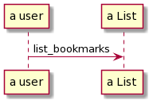

# Bookmark Manager

## User stories

> As a user, so I can revisit my favourite websites, I want to see a list of my bookmarks.

> As a user, so I can store my favourite websites, I want to add a new bookmark.

> As a user, so I can remove bookmarks I don't need, I want to delete a bookmark.

> As a user, so I can make changes and corrections, I want to update a bookmark.

## Domain model



## Installation

```bash
git clone https://github.com/rdupplaw/makers-bookmark-manager.git
cd makers-bookmark-manager
bundle
```

## Database configuration

1. Connect to `psql`
2. Create the database using the `psql` command `CREATE DATABASE bookmark_manager;`
3. Connect to the database using the `psql` command `\c bookmark_manager;`
4. Run the query in the file `01_create_bookmarks_table.sql`
5. Create a test database using the `psql` command `CREATE DATABASE bookmark_manager_test;`
6. Connect to the database using the `psql` command `\c bookmark_manager_test;`
7. Run the query in the file `01_create_bookmarks_table.sql`

## Usage

```bash
rackup
```
